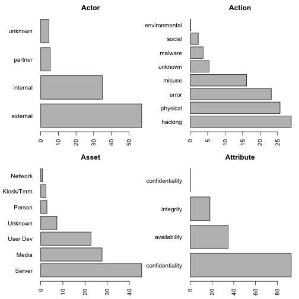
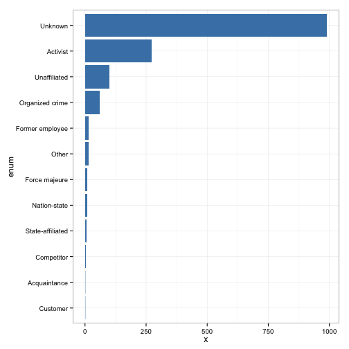
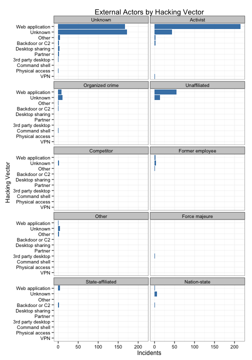
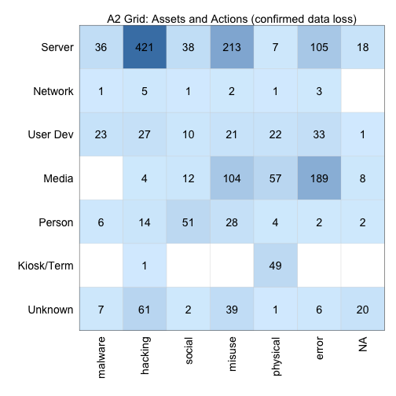

verisr
========================================================

This package is to support data analysis within the VERIS framework (http://veriscommunity.net).  It is intended to work directly with raw JSON and can be used against the VERIS Community Database (VCDB) found at (http://veriscommunity.net/doku.php?id=public) and (https://github.com/vz-risk/VCDB).

Install it from straight from github:


```r
library("devtools")
install_github("verisr", "jayjacobs")
```


To begin, load the package and point it at a directory of JSON files storing VERIS data.


```r
library(verisr)
vcdb.dir <- "../VCDB/data/json/"
vcdb <- json2veris(vcdb.dir)
```


Now that we have this, we can get a quick view of what's in the data:


```r
summary(vcdb)
```

```
## 2559 incidents in this object.
## 
## Actor:
## external internal  partner  unknown 
##     1464      893      137      120 
## 
## Action:
## environmental         error       hacking       malware        misuse 
##             3           593           740            94           412 
##      physical        social       unknown 
##           657            58           139 
## 
## Asset:
## Kiosk/Term      Media    Network     Person     Server    Unknown 
##         60        702         20         71       1155        186 
##   User Dev 
##        576 
## 
## Attribute:
##  confidentiality     availability  confidentiality        integrity 
##                2              894             2374              462
```


And let's look at a high level bar plot of the data:


```r
plot(vcdb)
```

 


Let's look for a specific variable:


```r
ext.variety <- getenum(vcdb, "actor.external.variety")
print(ext.variety)
```

```
##                enum   x
## 1           Unknown 991
## 2          Activist 255
## 3      Unaffiliated  99
## 4   Organized crime  59
## 5   Former employee  16
## 6             Other  14
## 7     Force majeure  10
## 8      Nation-state   8
## 9  State-affiliated   7
## 10       Competitor   4
## 11     Acquaintance   1
## 12         Customer   1
```


And we could create a barplot with ggplot:


```r
library(ggplot2)
gg <- ggplot(ext.variety, aes(x = enum, y = x))
gg <- gg + geom_bar(stat = "identity", fill = "steelblue")
gg <- gg + coord_flip() + theme_bw()
print(gg)
```

 


In progress: searching by two enumerations:


```r
hacking.actor <- getenumby(vcdb, "action.hacking.vector", "actor.external.variety")
head(hacking.actor)
```

```
##              enum         primary   x
## 1 Web application         Unknown 167
## 2 Web application        Activist 197
## 3 Web application Organized crime   8
## 4 Web application    Unaffiliated  55
## 5 Web application      Competitor   0
## 6 Web application Former employee   2
```


Now we can create all sorts of views of this data.
For example a faceted bar plot comparing the two:


```r
gg <- ggplot(hacking.actor, aes(x = enum, y = x))
gg <- gg + geom_bar(stat = "identity", fill = "steelblue")
gg <- gg + facet_wrap(~primary, ncol = 2)
gg <- gg + ylab("Incidents") + xlab("Hacking Vector")
gg <- gg + ggtitle("External Actors by Hacking Vector")
gg <- gg + coord_flip() + theme_bw()
print(gg)
```

 


Finally, let's set a filter for only confirmed loss events (data_disclosure="Yes").
Then get the interaction of the top level actions and assets.


```r
ddfilter <- getfilter(vcdb, and = list(attribute.confidentiality.data_disclosure = "Yes"))
action.asset <- getenumby(vcdb, enum = "asset.assets", primary = "action", filter = ddfilter)
head(action.asset)
```

```
##     enum primary   x
## 1 Server hacking 421
## 2 Server  misuse 213
## 3 Server   error 105
## 4 Server  social  38
## 5 Server unknown  18
## 6 Server malware  36
```


And now make a nice 2 x 2 grid with the data.

 


```
##    user  system elapsed 
##   6.742   0.361   7.536
```

