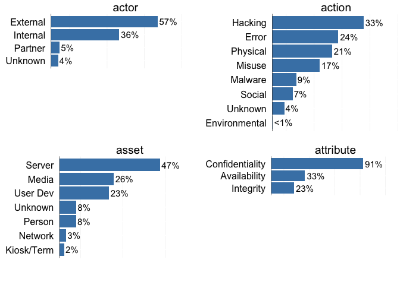
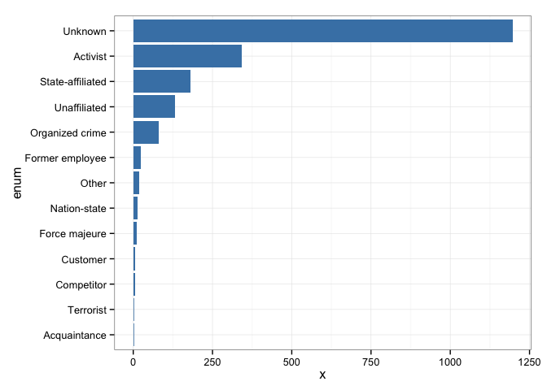
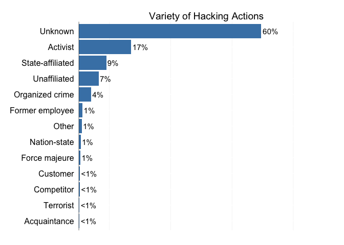
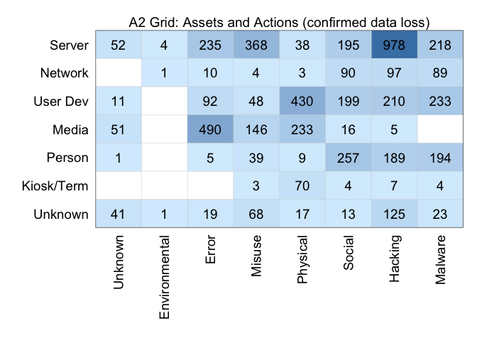

verisr
======

This package is to support data analysis within the VERIS framework (<http://veriscommunity.net>). It is intended to work directly with raw JSON and can be used against the VERIS Community Database (VCDB) found at (<http://veriscommunity.net/doku.php?id=public>) and (<https://github.com/vz-risk/VCDB>).

This package has two purposes. First is to convert one or more directories of VERIS (JSON) files into a usable object (in this version it is currently a data.table, but I hope to move to a dplyr object). Second, it offers a set of convenience functions for doing basic information retrieval from the object.

Install it from straight from github:

``` {.r}
# install devtools from https://github.com/hadley/devtools
library("devtools")
install_github("verisr", "jayjacobs")
```

To begin, load the package and point it at a directory of JSON files storing VERIS data.

``` {.r}
library(verisr)
vcdb.dir <- "../VCDB/data/json/"
# may optionally load a custom json schema file.
vcdb <- json2veris(vcdb.dir)
```

    ## Parsing record 1000 of 3527 
    ## Parsing record 2000 of 3527 
    ## Parsing record 3000 of 3527

What json2veris() returns is a plain data.table object, which enables you (the developer) to work directly with the data.

``` {.r}
class(vcdb)
```

    ## [1] "verisr"     "data.table" "data.frame"

``` {.r}
dim(vcdb)
```

    ## [1] 3527 1652

There are several convenience functions to get a feel for what's in the current verisr object.

``` {.r}
summary(vcdb)
```

    ## 3527 incidents in this object.

    ##       actor                action            asset     
    ##  External:2009   Environmental:   4   Kiosk/Term:  79  
    ##  Internal:1287   Error        : 834   Media     : 902  
    ##  Partner : 162   Hacking      :1152   Network   : 113  
    ##  Unknown : 133   Malware      : 303   Person    : 278  
    ##                  Misuse       : 600   Server    :1674  
    ##                  Physical     : 755   Unknown   : 280  
    ##                  Social       : 257   User Dev  : 822  
    ##                  Unknown      : 152                    
    ##                                                        
    ##            attribute   
    ##  Availability   :1174  
    ##  Confidentiality:3193  
    ##  Integrity      : 795  
    ##                        
    ##                        
    ##                        
    ##                        
    ##                        
    ## 

``` {.r}
plot(vcdb)
```

    ## Loading required package: ggplot2



Let's look for a specific variable:

``` {.r}
ext.variety <- getenum(vcdb, "actor.external.variety")
print(ext.variety)
```

    ##                 enum    x    n      freq
    ##  1:     Acquaintance    2 2009 0.0009955
    ##  2:        Terrorist    2 2009 0.0009955
    ##  3:       Competitor    5 2009 0.0024888
    ##  4:         Customer    5 2009 0.0024888
    ##  5:    Force majeure   11 2009 0.0054754
    ##  6:     Nation-state   13 2009 0.0064709
    ##  7:            Other   20 2009 0.0099552
    ##  8:  Former employee   25 2009 0.0124440
    ##  9:  Organized crime   81 2009 0.0403186
    ## 10:     Unaffiliated  131 2009 0.0652066
    ## 11: State-affiliated  180 2009 0.0895968
    ## 12:         Activist  342 2009 0.1702339
    ## 13:          Unknown 1196 2009 0.5953211

And we could create a barplot with ggplot:

``` {.r}
library(ggplot2)
gg <- ggplot(ext.variety, aes(x=enum, y=x))
gg <- gg + geom_bar(stat="identity", fill="steelblue")
gg <- gg + coord_flip() + theme_bw()
print(gg)
```



or use a built-in function to do the same thing (but a little prettier).

``` {.r}
print(simplebar(ext.variety, "Variety of Hacking Actions"))
```



Filters have changed
====================

The way filters are handled are different. The old function of getfilter() has been removed, it would just return a vector of logicals the same length as the verisr object which would indicate which records to use. Since you have the data (the verisr object is just a data.table) and all the enumerations are logical values, it should be trivial to create a filter. For example, to filter on all the incidents with confirmed data loss, and then further filter for hacking vector of web appliation...

``` {.r}
# see the docs on data.table for getting columns like this
ddfilter <- vcdb[["attribute.confidentiality.data_disclosure.Yes"]]
webfilter <- vcdb[["action.hacking.vector.Web application"]]
# now we can combine with | or & ("or" and "and" respectively)
# to filter incidents with confirmed data loss and web vector:
ddweb <- ddfilter & webfilter
```

Since these are just logical vectors now, we can use sum() to see how many matches.

``` {.r}
cat("Confirmed data loss events:", sum(ddfilter), "\n")
```

    ## Confirmed data loss events: 2036

``` {.r}
cat("Hacking vector of web apps:", sum(webfilter), "\n")
```

    ## Hacking vector of web apps: 588

``` {.r}
cat("Both data loss and web app:", sum(ddweb), "\n")
```

    ## Both data loss and web app: 297

Special names added to verisr object
====================================

Most of the names to query are obvious from the schema. Things like "actor.external.motive" for example is relatively intuitive. But when the verisr object is created there are several more fields dervied from the data to make queries easier. Those are:

-   *actor* will return top level actor categories
-   *action* will return top level action categories
-   *asset.variety* will return top level asset categories
-   *attribute* will return top level asset categories
-   *victim.industry2* will return the first 2 digits of the NAICS code
-   *victim.industry3* same, first 3 digits
-   *victim.orgsize* returns "Large" and "Small" enumerations

If you come across any more that you'd like added, please reach out.

Querying Multiple Enumerations
==============================

One rather fun feature of the lastest version is the ability to query for an enumeration as it relates to one or more other enumerations. For example, if you wanted to create a A2 grid, which compares the action categories to the asset categories, it's a single query:

``` {.r}
a2 <- getenumby(vcdb, c("action", "asset.variety"))
a2
```

    ##              enum      enum1   x    n      freq
    ##  1:       Malware     Server 218 3527 0.0618089
    ##  2:       Hacking     Server 978 3527 0.2772895
    ##  3:        Social     Server 195 3527 0.0552878
    ##  4:      Physical     Server  38 3527 0.0107740
    ##  5:        Misuse     Server 368 3527 0.1043380
    ##  6:         Error     Server 235 3527 0.0666289
    ##  7: Environmental     Server   4 3527 0.0011341
    ##  8:       Unknown     Server  52 3527 0.0147434
    ##  9:       Malware    Network  89 3527 0.0252339
    ## 10:       Hacking    Network  97 3527 0.0275021
    ## 11:        Social    Network  90 3527 0.0255174
    ## 12:      Physical    Network   3 3527 0.0008506
    ## 13:        Misuse    Network   4 3527 0.0011341
    ## 14:         Error    Network  10 3527 0.0028353
    ## 15: Environmental    Network   1 3527 0.0002835
    ## 16:       Unknown    Network   0 3527 0.0000000
    ## 17:       Malware   User Dev 233 3527 0.0660618
    ## 18:       Hacking   User Dev 210 3527 0.0595407
    ## 19:        Social   User Dev 199 3527 0.0564219
    ## 20:      Physical   User Dev 430 3527 0.1219166
    ## 21:        Misuse   User Dev  48 3527 0.0136093
    ## 22:         Error   User Dev  92 3527 0.0260845
    ## 23: Environmental   User Dev   0 3527 0.0000000
    ## 24:       Unknown   User Dev  11 3527 0.0031188
    ## 25:       Malware      Media   0 3527 0.0000000
    ## 26:       Hacking      Media   5 3527 0.0014176
    ## 27:        Social      Media  16 3527 0.0045364
    ## 28:      Physical      Media 233 3527 0.0660618
    ## 29:        Misuse      Media 146 3527 0.0413950
    ## 30:         Error      Media 490 3527 0.1389283
    ## 31: Environmental      Media   0 3527 0.0000000
    ## 32:       Unknown      Media  51 3527 0.0144599
    ## 33:       Malware     Person 194 3527 0.0550043
    ## 34:       Hacking     Person 189 3527 0.0535866
    ## 35:        Social     Person 257 3527 0.0728665
    ## 36:      Physical     Person   9 3527 0.0025517
    ## 37:        Misuse     Person  39 3527 0.0110576
    ## 38:         Error     Person   5 3527 0.0014176
    ## 39: Environmental     Person   0 3527 0.0000000
    ## 40:       Unknown     Person   1 3527 0.0002835
    ## 41:       Malware Kiosk/Term   4 3527 0.0011341
    ## 42:       Hacking Kiosk/Term   7 3527 0.0019847
    ## 43:        Social Kiosk/Term   4 3527 0.0011341
    ## 44:      Physical Kiosk/Term  70 3527 0.0198469
    ## 45:        Misuse Kiosk/Term   3 3527 0.0008506
    ## 46:         Error Kiosk/Term   0 3527 0.0000000
    ## 47: Environmental Kiosk/Term   0 3527 0.0000000
    ## 48:       Unknown Kiosk/Term   0 3527 0.0000000
    ## 49:       Malware    Unknown  23 3527 0.0065211
    ## 50:       Hacking    Unknown 125 3527 0.0354409
    ## 51:        Social    Unknown  13 3527 0.0036859
    ## 52:      Physical    Unknown  17 3527 0.0048200
    ## 53:        Misuse    Unknown  68 3527 0.0192798
    ## 54:         Error    Unknown  19 3527 0.0053870
    ## 55: Environmental    Unknown   1 3527 0.0002835
    ## 56:       Unknown    Unknown  41 3527 0.0116246
    ##              enum      enum1   x    n      freq

And we can now just visualize that with ggplot in a nice 2x2 grid



    ##    user  system elapsed 
    ##  27.565   0.265  28.400
