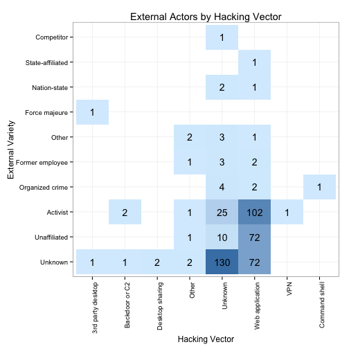

verisr
========================================================

This package is to support data analysis within the VERIS framework (http://veriscommunity.net).  It is intended to work directly with raw JSON and can be used against the VERIS Community Database (VCDB) found at (http://veriscommunity.net/doku.php?id=public) and (https://github.com/vz-risk/VCDB).

Install it from straight from github:


```r
library("devtools")
install_github("verisr", "vz-risk")
```


To begin, load the package and point it at a directory of JSON files storing VERIS data.


```r
library(verisr)
vcdb.dir <- "../VCDB/incidents"
vcdb <- json2veris(vcdb.dir)
```


Now that we have this, we can get a quick view of what's in the data:


```r
summary(vcdb)
```

```
## 1737 incidents in this object.
## 
## Actor:
## external internal  partner  unknown 
##     1024      556      104       86 
## 
## Action:
## external internal  partner  unknown 
##     1024      556      104       86 
## 
## Asset:
## Kiosk/Term      Media    Network     Person     Server    Unknown 
##         18        546         10         37        724         86 
##   User Dev 
##        447 
## 
## Attribute:
##  confidentiality     availability  confidentiality        integrity 
##               61              639             1629              190
```


And let's look at a high level bar plot of the data:


```r
plot(vcdb)
```

 


Let's look for a specific variable:


```r
ext.variety <- getenum(vcdb, "actor.external.variety")
print(ext.variety)
```

```
##                enum   x
## 1        Competitor   1
## 2          Customer   1
## 3  State-affiliated   2
## 4     Force majeure   3
## 5      Nation-state   3
## 6             Other   9
## 7   Former employee  11
## 8   Organized crime  21
## 9          Activist 134
## 10     Unaffiliated 220
## 11          Unknown 619
```


And we could create a barplot with ggplot:


```r
library(ggplot2)
gg <- ggplot(ext.variety, aes(x = enum, y = x))
gg <- gg + geom_bar(stat = "identity", fill = "steelblue")
gg <- gg + coord_flip() + theme_bw()
print(gg)
```

 


In progress: searching by two enumerations:


```r
hacking.actor <- getenumby(vcdb, "action.hacking.vector", "actor.external.variety")
head(hacking.actor)
```

```
##                enum   x primary
## 1 3rd party desktop   1 Unknown
## 2    Backdoor or C2   1 Unknown
## 3   Desktop sharing   2 Unknown
## 4             Other   2 Unknown
## 5           Unknown 130 Unknown
## 6   Web application  72 Unknown
```


Now we can create all sorts of views of this data.
For example a faceted bar plot comparing the two:


```r
gg <- ggplot(hacking.actor, aes(x = enum, y = x))
gg <- gg + geom_bar(stat = "identity", fill = "steelblue")
gg <- gg + facet_wrap(~primary, ncol = 2)
gg <- gg + ylab("Incidents") + xlab("Hacking Vector")
gg <- gg + ggtitle("External Actors by Hacking Vector")
gg <- gg + coord_flip() + theme_bw()
print(gg)
```

 


Or perhaps a heat map with the count in the box:

```r
gg <- ggplot(hacking.actor, aes(x = enum, y = primary, fill = x, label = x))
gg <- gg + geom_tile() + geom_text()
gg <- gg + scale_fill_gradient(low = "#D8EEFE", high = "#4682B4")
gg <- gg + ylab("External Variety") + xlab("Hacking Vector")
gg <- gg + ggtitle("External Actors by Hacking Vector")
gg <- gg + theme_bw()
gg <- gg + theme(axis.text.x = element_text(angle = 90, hjust = 1), legend.position = "none")
print(gg)
```

 


```
##    user  system elapsed 
##   4.263   0.096   4.392
```

